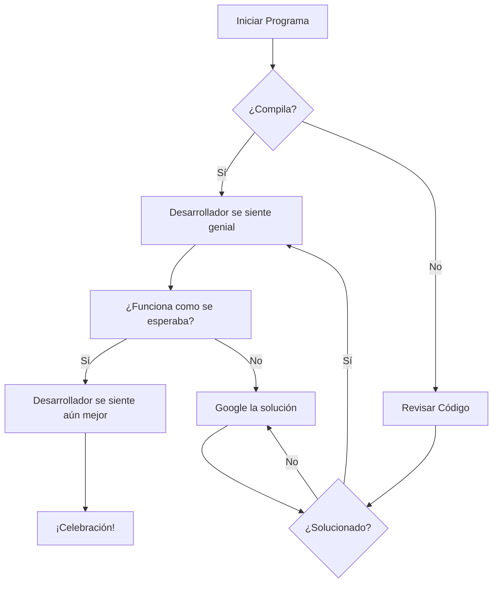

```mermaid
graph TD
  A[Iniciar Programa]
  B{¿Compila?}
  C[Desarrollador se siente genial]
  D[¿Funciona como se esperaba?]
  E[Desarrollador se siente aún mejor]
  F[¡Celebración!]

  A --> B
  B -->|Sí| C
  B -->|No| X[Revisar Código]
  X --> Y{¿Solucionado?}
  Y -->|Sí| C
  Y -->|No| Z[Google la solución]
  Z --> Y
  C --> D
  D -->|Sí| E
  D -->|No| Z
  E --> F
```

